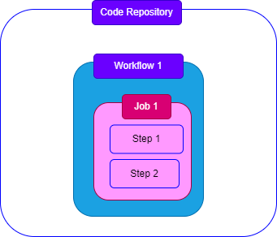

[Home](../index.md)
# Github Actions

GitHub Actions makes it easy to automate all your software workflows, now with world-class CI/CD. Build, test, and deploy your code right from GitHub. Make code reviews, branch management, and issue triaging work the way you want.  

# Blocks

There are 3 building blocks.  

1. Workflows  
2. Jobs  
3. Steps

Index 

1. 